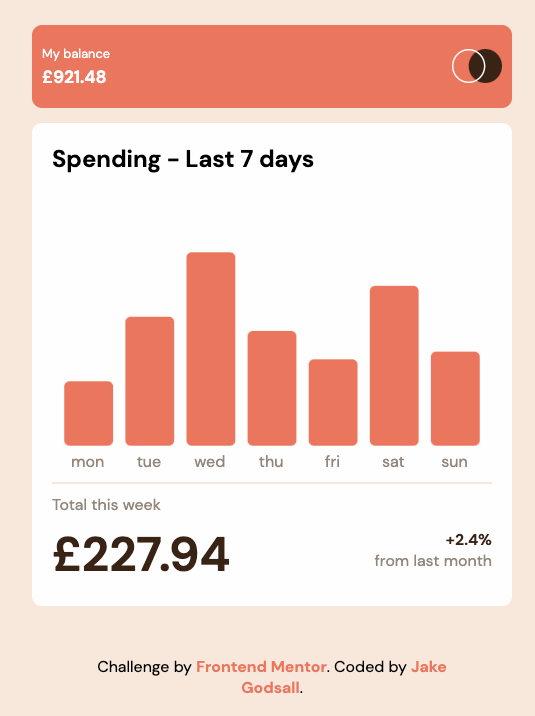

# Frontend Mentor - Expenses chart component solution

This is a solution to the
[Expenses chart component challenge on Frontend Mentor](https://www.frontendmentor.io/challenges/expenses-chart-component-e7yJBUdjwt).
Frontend Mentor challenges help you improve your coding skills by building
realistic projects.

## Table of contents

- [Frontend Mentor - Expenses chart component solution](#frontend-mentor---expenses-chart-component-solution)
  - [Table of contents](#table-of-contents)
  - [Overview](#overview)
    - [The challenge](#the-challenge)
    - [Screenshot](#screenshot)
    - [Links](#links)
  - [My process](#my-process)
    - [Built with](#built-with)
    - [What I learned](#what-i-learned)
  - [Author](#author)

## Overview

### The challenge

Users should be able to:

&#9745;   View the bar chart and hover over the individual bars to see the correct amounts for each day

&#9745;   See the current day’s bar highlighted in a different colour to the other bars

&#9745;  View the optimal layout for the content depending on their device’s screen size

&#9745; See hover states for all interactive elements on the page

&#9745; **Bonus**: Use the JSON data file provided to dynamically size the bars on
    the chart

### Screenshot

### Links

-   Solution URL: [Netlify](https://jakegodsall-expenses-chart.netlify.app/)

## My process

### Built with

-   Semantic HTML5 markup
-   CSS custom properties
-   Flexbox
-   CSS Grid
-   BEM CSS Naming Convention
-   7-1 CSS Architecture
-   Mobile-first workflow
-   Vanilla JavaScript
-   [D3.js](https://d3js.org/)

### What I learned

This is my second solution to the [Expenses chart component challenge on Frontend Mentor](https://www.frontendmentor.io/challenges/expenses-chart-component-e7yJBUdjwt).

I decided to do it again as I have been learning D3 and it seemed a great opportunity to practice what I had learned.

I have learned a ton about D3, and SVGs in general. Some things I have learned are:

- How to make responsive SVGs.
- How to structure an SVG using the `g` element.
- How to add animations to visualisations with the `.transition()` method.
- How to import data with D3.

## Author

-   Website - [jakegodsall](https://jakegodsall.com)
-   Frontend Mentor - [@jakegodsall](https://www.frontendmentor.io/profile/yourusername)
-   LinkedIn - [@godsalljake](https://www.linkedin.com/in/godsalljake/)
