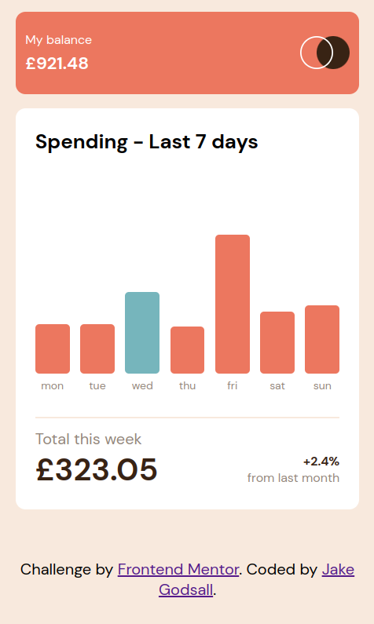

# Frontend Mentor - Expenses chart component solution

This is a solution to the
[Expenses chart component challenge on Frontend Mentor](https://www.frontendmentor.io/challenges/expenses-chart-component-e7yJBUdjwt).
Frontend Mentor challenges help you improve your coding skills by building
realistic projects.

## Table of contents

-   [Overview](#overview)
    -   [The challenge](#the-challenge)
    -   [Screenshot](#screenshot)
    -   [Links](#links)
-   [My process](#my-process)
    -   [Built with](#built-with)
    -   [What I learned](#what-i-learned)
    -   [Continued development](#continued-development)
    -   [Useful resources](#useful-resources)
-   [Author](#author)
-   [Acknowledgments](#acknowledgments)

**Note: Delete this note and update the table of contents based on what sections
you keep.**

## Overview

### The challenge

Users should be able to:

-   View the bar chart and hover over the individual bars to see the correct
    amounts for each day
-   See the current day’s bar highlighted in a different colour to the other
    bars
-   View the optimal layout for the content depending on their device’s screen
    size
-   See hover states for all interactive elements on the page
-   **Bonus**: Use the JSON data file provided to dynamically size the bars on
    the chart

### Screenshot

### Links

-   Solution URL: [Netlify](https://jakegodsall-expenses-chart.netlify.app/)

## My process

### Built with

-   Semantic HTML5 markup
-   CSS custom properties
-   Flexbox
-   CSS Grid
-   BEM CSS Naming Convention
-   7-1 CSS Architecture
-   Mobile-first workflow
-   Vanilla JavaScript

**Note: These are just examples. Delete this note and replace the list above
with your own choices**

### What I learned

This is the first project that I have worked on from the second difficulty level
at [Frontend Mentor](https://www.frontendmentor.io/).

The dynamic aspects of the component were far more challenging than anything I
have previously come across, but I very much enjoyed the project.

There are a number of things that I have added to the project to make it a
little more interesting:

-   Dynamically changing bars in the visualisation according to the values
    stored in the weekly expenditure object.
-   Showing the actual total in the DOM from the weekly expenditure object.

Some things that I have learned from this project are:

-   How to use `position:relative` on a parent element and `position:absolute`
    on the child element for ease of absolute positioning.
-   How to create a complete new element in JavaScript and render it into the
    DOM during an event.

### Continued development

One thing that I would like to do to continue working on this project in the
future is to solve the problem that will occur when the value for the weekly
total gets too large. Thiss will cause the component to expand and look ugly.

## Author

-   Website - [jakegodsall](https://jakegodsall.com)
-   Frontend Mentor -
    [@jakegodsall](https://www.frontendmentor.io/profile/yourusername)
-   LinkedIn - [@godsalljake](https://www.linkedin.com/in/godsalljake/)
